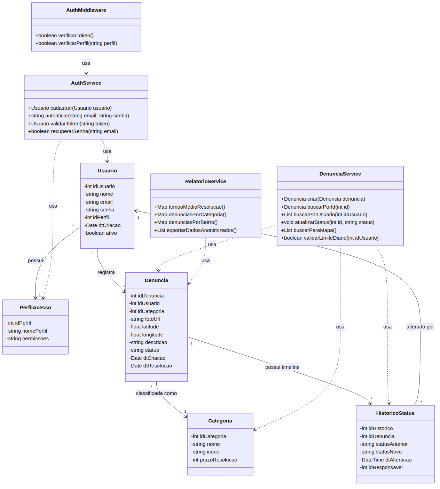

# Diagrama de Classes UML

> Diagrama renderizado externamente (Mermaid → PNG) porque o preview do VS Code nao suporta `classDiagram`. Fonte: `docs/images/src/class-diagram.mmd`. Re-renderizar com: `mmdc -i docs/images/src/class-diagram.mmd -o docs/images/class-diagram.png -w 1280 -b white`

