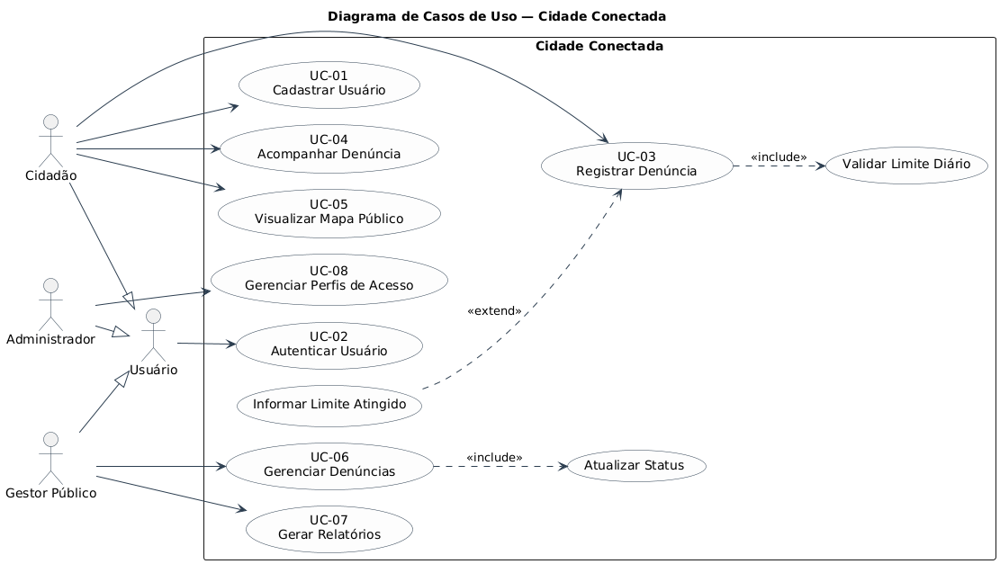
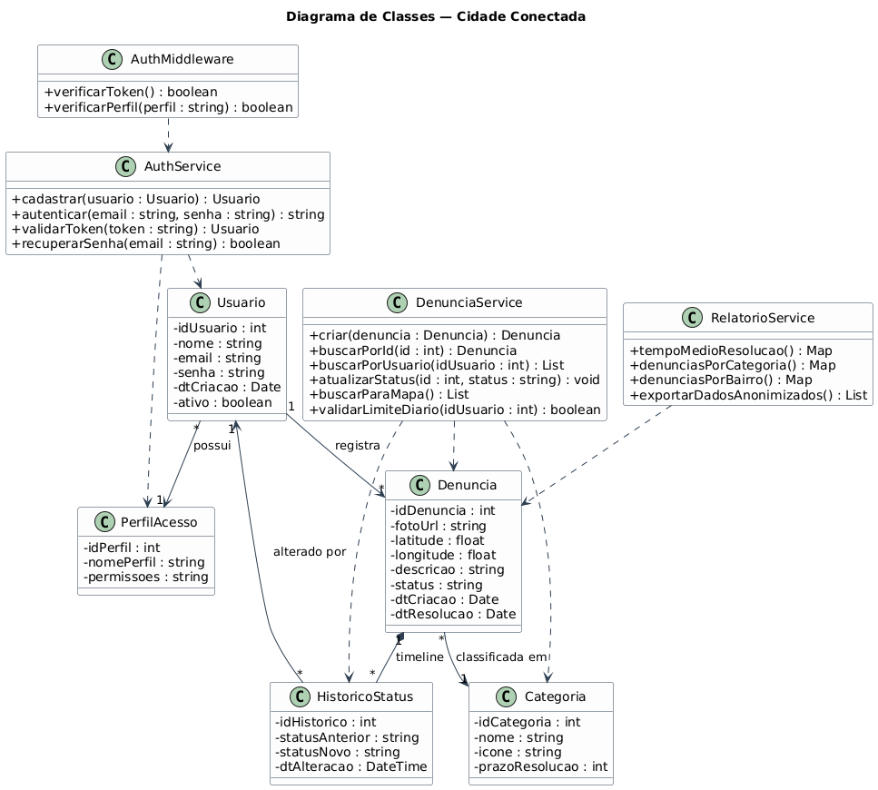
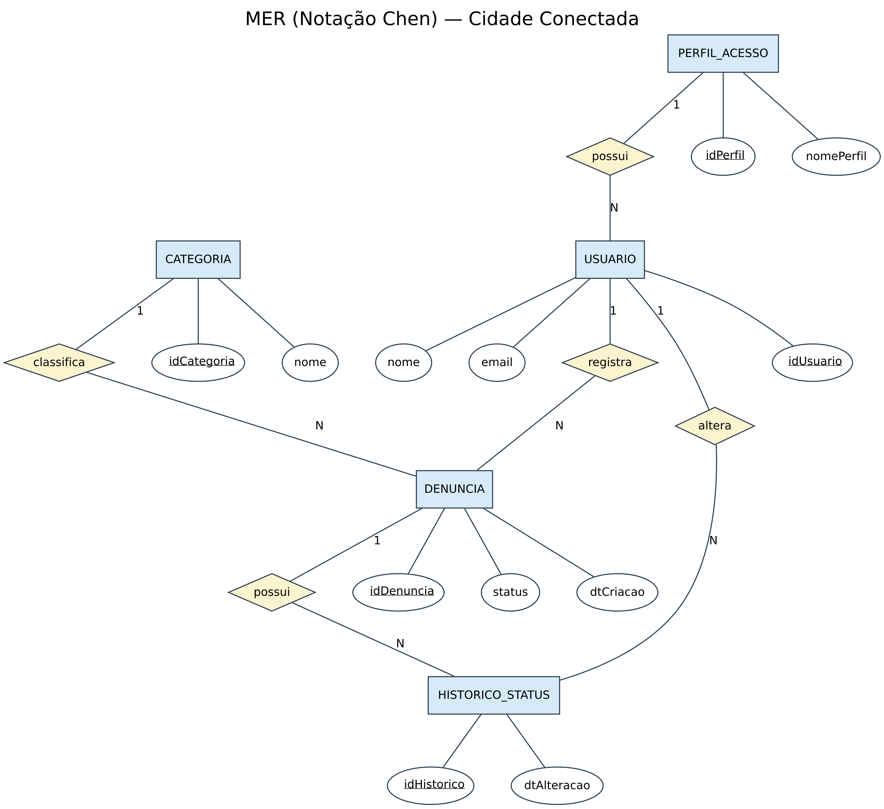
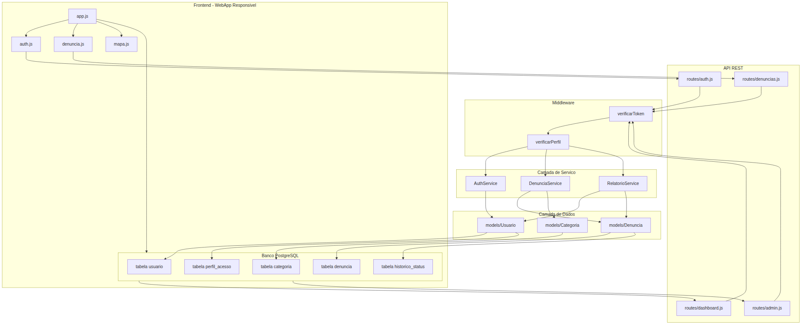
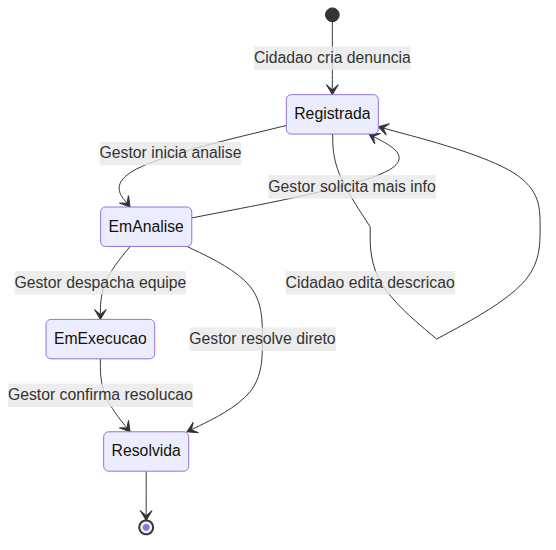
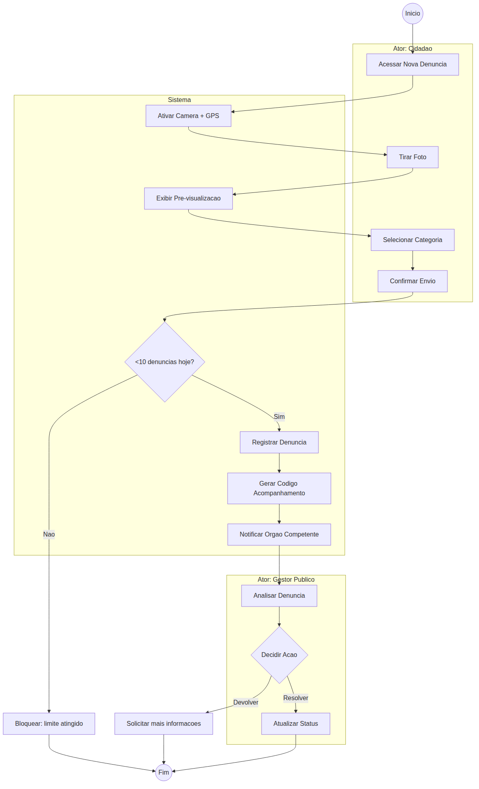
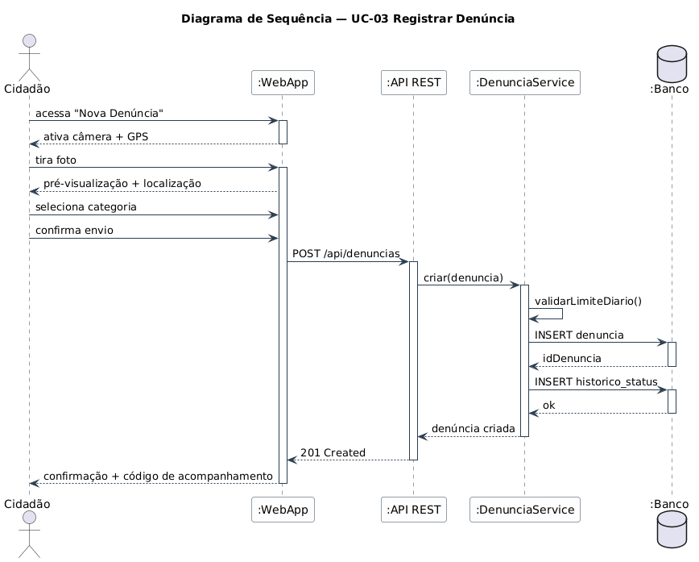
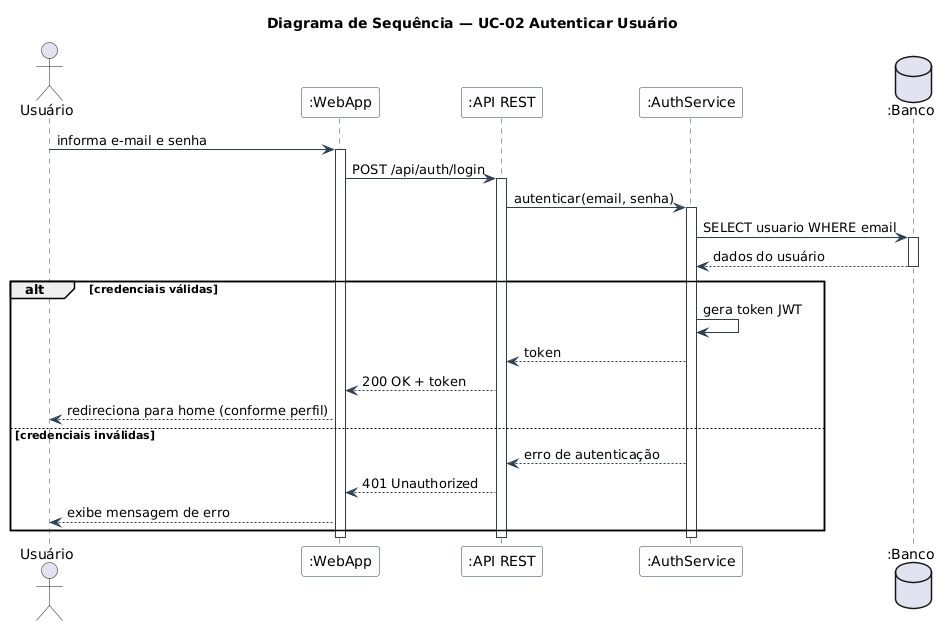
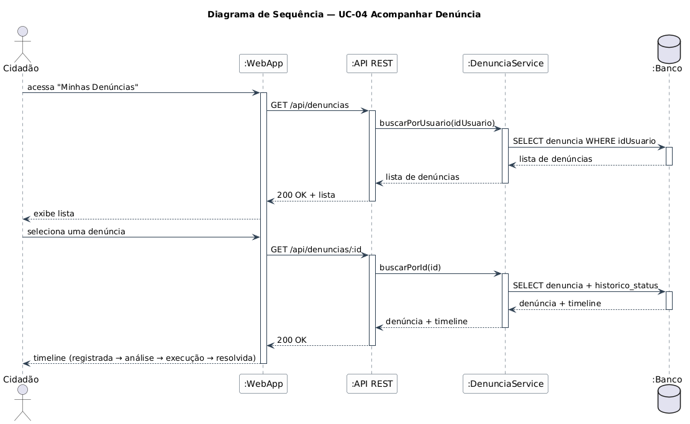

# Technical Design — Cidade Conectada

| Documento | Technical Design |
| :--- | :--- |
| **Versão** | 1.0 |
| **Padrão Arquitetural** | MVC / Camadas |

---

## 1. Arquitetura em Camadas

```
 ┌─────────────────────────────────────┐
 │         Interface do Usuário        │  ← WebApp Responsivo (HTML/CSS/JS)
 ├─────────────────────────────────────┤
 │         Camada de Serviço           │  ← Regras de negócio + validações
 ├─────────────────────────────────────┤
 │    API REST (Controllers + Routes)  │  ← Endpoints JSON
 ├─────────────────────────────────────┤
 │       Camada de Dados (Models)      │  ← ORM ou queries SQL
 ├─────────────────────────────────────┤
 │         Banco de Dados              │  ← PostgreSQL / MySQL
 └─────────────────────────────────────┘
```

**Fluxo de chamada:**

```
[WebApp] → [API REST] → [Service] → [Model/DAO] → [Banco]
```

---

## 2. Estrutura de Diretórios

```
cidade-conectada/
├── frontend/
│   ├── index.html
│   ├── css/
│   │   └── style.css
│   ├── js/
│   │   ├── app.js
│   │   ├── auth.js
│   │   ├── denuncia.js
│   │   ├── mapa.js
│   │   └── dashboard.js
│   └── assets/
│       └── images/
├── backend/
│   ├── server.js / app.py / Application.java
│   ├── routes/
│   │   ├── auth.js
│   │   ├── denuncias.js
│   │   ├── dashboard.js
│   │   └── admin.js
│   ├── models/
│   │   ├── Usuario.js
│   │   ├── Denuncia.js
│   │   └── Categoria.js
│   ├── services/
│   │   ├── AuthService.js
│   │   ├── DenunciaService.js
│   │   └── RelatorioService.js
│   └── middleware/
│       ├── auth.js
│       └── permissao.js
├── database/
│   ├── schema.sql
│   └── seeds.sql
├── docs/
│   └── ...
└── README.md
```

---

## 3. Modelo Relacional

```
 ┌──────────────┐       ┌──────────────────┐
 │   usuario    │──1:N──│    denuncia      │
 └──────────────┘       └──────────────────┘
        │                       │
        │                       ├── N:1 ──┐
        │                       │         │
        │                  ┌────▼─────┐   │
        │                  │ categoria│   │
        │                  └──────────┘   │
        │                                 │
 ┌──────┴──────┐                          │
 │ perfil_acesso│                          │
 └─────────────┘                          │
                                          │
 ┌──────────────────────────┐             │
 │   historico_status       │────N:1──────┘
 └──────────────────────────┘
```

### Dicionário de Dados

| Tabela | Descrição | PK | FK |
| :--- | :--- | :--- | :--- |
| `usuario` | Usuários do sistema (cidadão, gestor, admin) | `id_usuario` | — |
| `perfil_acesso` | Perfis de permissão | `id_perfil` | — |
| `denuncia` | Denúncias registradas | `id_denuncia` | `id_usuario`, `id_categoria` |
| `categoria` | Categorias de problema (buraco, lixo, etc.) | `id_categoria` | — |
| `historico_status` | Timeline de mudanças de status | `id_historico` | `id_denuncia` |

---

## 4. Diagrama de Casos de Uso



---

## 5. Diagrama de Classes UML



---

## 6. Diagrama Entidade-Relacionamento (MER — Notação Chen)



---

## 7. Diagrama de Componentes



---

## 8. Diagrama de Estados — Ciclo da Denúncia



---

## 9. Diagrama de Atividade — Fluxo de Denúncia



---

## 10. Diagramas de Sequência

### Registrar Denúncia (UC-03)



### Autenticar Usuário (UC-02)



### Acompanhar Denúncia (UC-04)



---

## 11. Mapa de Armadilhas Comuns

| # | Problema | Sintoma | Solução |
| :--- | :--- | :--- | :--- |
| 1 | GPS não capturado | Denúncia sem localização | Solicitar permissão e fallback para input manual |
| 2 | Foto muito grande | Upload lento | Comprimir imagem no frontend antes do envio |
| 3 | Token expirado | API retorna 401 | Implementar refresh token automático |
| 4 | CORS bloqueado | Requisição rejeitada no browser | Configurar CORS no backend |
| 5 | Dados sensíveis expostos | Informações vazadas | Aplicar RNG-12 (anonimização) e HTTPS |

---

## 7. Glossário Técnico

| Termo | Definição |
| :--- | :--- |
| **API REST** | Interface de comunicação via HTTP com métodos padronizados |
| **GPS** | Global Positioning System — geolocalização por satélite |
| **WebApp** | Aplicação web responsiva acessada pelo navegador |
| **PWA** | Progressive Web App — experiência similar a app nativo |
| **JWT** | JSON Web Token — padrão de autenticação |
| **CRUD** | Create, Read, Update, Delete |
| **MVP** | Minimum Viable Product — versão validável |

---

## 8. API Endpoints (Proposta)

| Método | Rota | Ação | Autenticação |
| :--- | :--- | :--- | :--- |
| POST | `/api/auth/register` | Cadastrar usuário | Não |
| POST | `/api/auth/login` | Autenticar | Não |
| POST | `/api/denuncias` | Registrar denúncia | JWT Cidadão |
| GET | `/api/denuncias` | Listar denúncias do usuário | JWT |
| GET | `/api/denuncias/:id` | Detalhe da denúncia | JWT |
| GET | `/api/denuncias/mapa` | Denúncias para mapa público | Não |
| PUT | `/api/denuncias/:id/status` | Atualizar status | JWT Gestor |
| GET | `/api/dashboard` | Dashboard do gestor | JWT Gestor |
| GET | `/api/admin/usuarios` | Listar usuários | JWT Admin |
